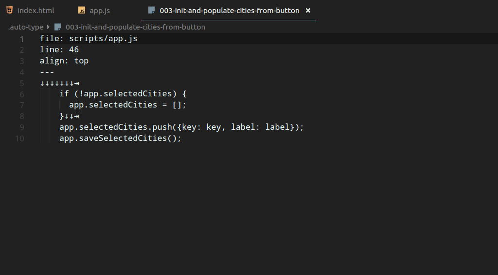

# auto-type

Never live code again! Type it up ahead of time in a simple format, then replay it for 100% typing accuracy each time.

## Features

In addition to typing code, auto-type can :

* move the cursor left and right
* move the cursor up and down
* Move the cursor to the beginning and end of the line
* delete characters

Here is auto-type in action:



To use auto-type, you type up the script you want to follow, one page at a time. The script pages are stored in the `.auto-type` directory in the root folder of your project. The script pages are ordered by filename.

> Tip: To order your pages, give each page a name that starts with a number like `001-description`, `002-description-of-page-2`, etc.

Script pages look like:

```
file: scripts/app.js
line: 46
align: top
---
↓↓↓↓↓↓↓⇥
    if (!app.selectedCities) {
      app.selectedCities = [];
    }↓↓⇥
    app.selectedCities.push({key: key, label: label});
    app.saveSelectedCities();
```

Pages consist of two parts (separated by a line with three dashes):

1. The front-matter, which describes which file you're editing, line numbers, etc.
2. The actual characters to type.

### Front-matter

Front-matter goes at the top of the script page, above the triple-dash separator. Supported attributes include:

* `file` - the path to the file to be edited (required, can be relative to your project's root directory)
* `line` - the line number to start at (optional, defaults to `1`)
* `col` - the column number of start at (optional, defaults to `1`)
* `align` - where to position the active line in the editor viewport (optional, defaults to `middle`, can also be set to `top`)

> IMPORTANT: the file should already be open in VS Code when starting the script. Don't rely on auto-type to open it!

> Tip: Use `col` sparingly. It's more realistic to start at the beginning of the line, then arrow over to the place you want to start typing (see `Script Content` below)

> TIP: Setting align to `top` is useful with large functions / methods.

### Script Content

Inside script page files, the content can be as simple as code that you want to type:

```
file: service-worker.js
---
var cacheName = 'weatherPWA-step-6-1';
var filesToCache = [];
```

The real power of auto-type comes from it's active unicode support. Following is the list of active unicode characters supported by auto-type:

| Character | Name | Description |
|:---------:|------|-------------|
| ↓         | Down Arrow      | Move the cursor down one line |
| ↑         | Up Arrow        | Move the cursor up one line |
| →         | Right Arrow     | Move the cursor right one character |
| ←         | Left Arrow      | Move the cursor left one character |
| ⇥         | Right Arrow Bar | Move the cursor to the end of the line |
| ⇤         | Left Arrow Bar  | Move the cursor to the beginning of the line |
| ⌫         | Backspace       | Delete the character to the left of the cursor |

> Tip: combine active unicode to achieve realistic typing. For example, to move to the end of the line, then back three characters, use: `⇥←←←`.

> Tip: newlines are significant. Don't hit `Enter` in between active unicode unless you want a newline. Newline at the end of the file will type insert a newline at the very end of typing.

### Running Script Pages

Scripts are run one page at a time with the `Play Code Script` command.

While developing script, the `Restart Code Script` will restart the script with the first page.

## Requirements

I am unsure if this works on Windows yet.

## Extension Settings

There are no supported settings yet.

## Known Issues

This is a very early release. It likely does not work on Windows yet with CRLF newlines and probably doesn't work with Windows file paths.

auto-type does not:

* trigger code completion
* trigger auto-termination of blocks (e.g. the closing parenthesis when the opening parenthesis is typed)

auto-type uses VS Code's insert API to "type." In other words, it copies and pastes code, one character at a time.

## Release Notes

### 0.1.0

Initial beta release. Minimal viable features:

* Left/right cursor movement
* Up/down cursor movement
* Beginning/end of line movement
* Delete
